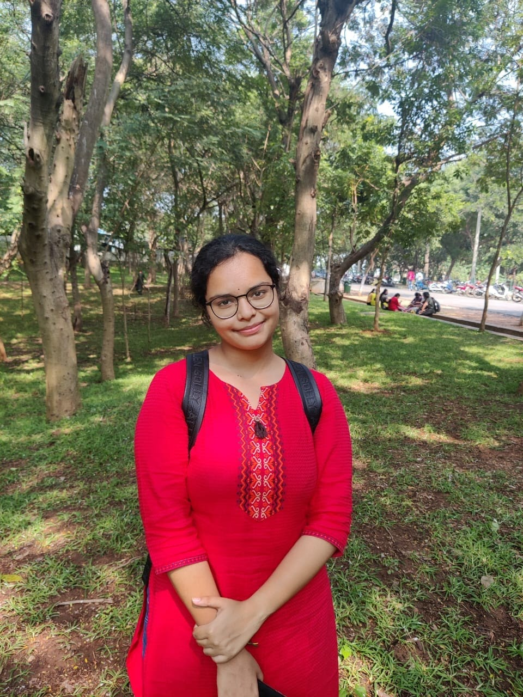

# **Hello People**
I am ***Aparna***  
**Interests**
Classical Dance, Carnatic Music, Mathematics  
**Clubs I am in:**  
>Toastmasters  
>IEEE  
>Cooking Club  
>Pragnya Club
**Intersting work**
So... Currently, I am working on a project which will be a solution to the biggest problem in the world.  
Let me get 
I am trying to solve the fundamental problem that our society is going to face in a short time. We might think that water is unlimited. But it is not. The main concern is fresh water sources are becoming less due to various societal and environmental factors. So the only alternative left is to use the recycled water. I wanted to provide service on treatment of grey water (used water).  
If you are interested in this project, you can jointhe team.  
**Now you know 1% about me**
**Good day**
