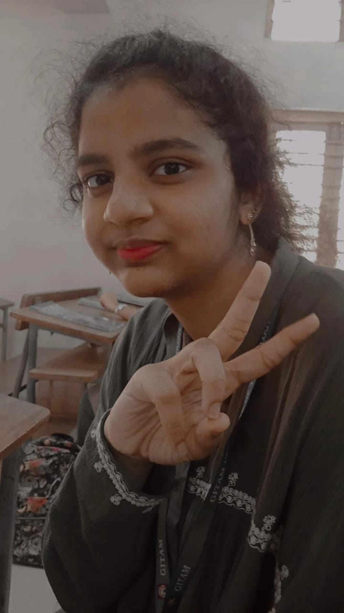

# NANDIGAMA ANUSHKA VAISHNAVI

Hi,
I am Anushka. 
My current academic endeavor is B.Tech in CSE. I'm currently a member of the ACM club.
I am a passionate coder that strives to solve any challenge that comes my way.
In the near future, I want to establish myself as someone who is self-reliant, unfettered, and has a prominent role in the IT industry.
I enjoy learning new stuff. 
It's much fun for me to get to know new individuals.
I enjoy learning different languages. I want to understand every part of a language, such as vocabulary, grammar, linguistic sound, and how words change through time.

  
