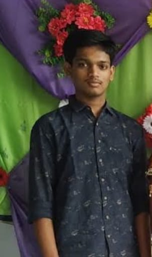

# SAIRAM GINJUPALLI
  
## About me :

> This is Sairam ginjupalli.  
> I have done my schooling in **DR.KKR'S GOWTHAM**, Gudavalli.    
> I am currently pursuing B.Tech in **GITAM** university.  
> Interested in web development.   
> I am a cool guy, Nature lover, wish to have fun 😊.

### links  :
- [linkedin](https://www.linkedin.com/in/sairam-ginjupalli-17087b246/)  
- [Github](https://github.com/sairamginjupalli)
- Gmail : sginjupa@gitam.in

### PROGRAMMING LANGUAGES
Here are basic programs in **C** , **Python** , **HTML** .
``` C
//  C PROGRAM
#include <stdio.h>
int main() {
   printf("Hello, Pragnya club members!");
   return 0;
}
```
[Start  Learning  **C**](https://www.programiz.com/c-programming)
```python
# Python PROGRAM
    print("Hello, Pragnya club members")
```
[Start  Learning  **Python**](https://www.programiz.com/python-programming)
```html
// HTML PROGRAM
<head> </head>
<html>
<h1>Hello, Pragnya club members!</h1> 
</html>
}
```
[Start  Learning  **HTML**](https://www.w3schools.com/html/default.asp)


