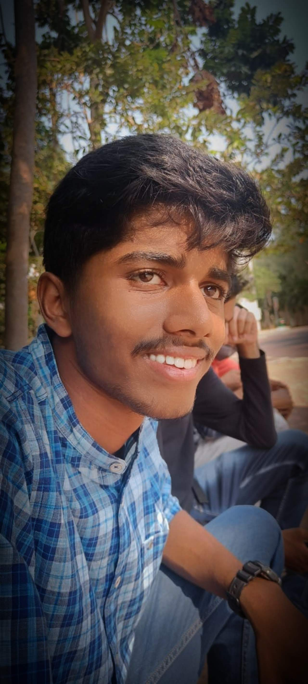

# Mallipeddi Sandeep.  
I am from narasaraopet. My SSC and inter education I completed in my hometown.  
I want to complete my B.tech course in best institution. So I joined in GITAM.   
Before my B.tech I am just an average or below average student. Now also I belongs to same categeory .  
While it comes to programing I am good in it but I can say I am not perfect. But than other subjects I am good at programing.  
My dream is to buy AFRICA TWIN.  

  