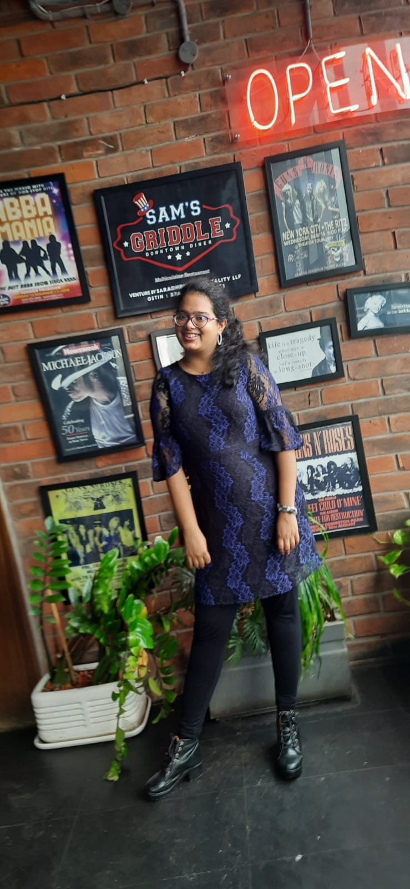

I am Veenadhari presently pursuing my 2nd year in Btech CSE-Data Science at Gitam University, Vizag.
I am a Carnatic Vocalist and Veena Artist.
I like watching horror movies.
I've always been fascinated by data which made me pursue a degree in Data Science.
I also like morning walks at the beach.
I like playing badminton.
I recently attended "THE MATRIX" workshop conducted by the team CXR.

